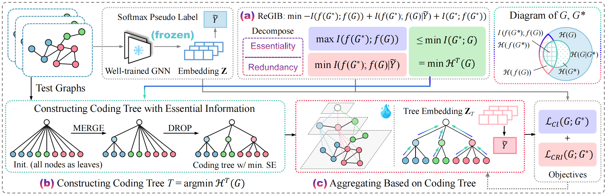

# [NeurIPS 2025] Redundancy-Aware Test-Time Graph Out-of-Distribution Detection

This repository is the official implementation of "[Redundancy-Aware Test-Time Graph Out-of-Distribution Detection](https://openreview.net/forum?id=CQBiYvXLgz)" accepted by the 39th Conference on Neural Information Processing Systems (NeurIPS 2025).

[](https://openreview.net/forum?id=CQBiYvXLgz)

------

## 0. Abstract

Distributional discrepancy between training and test data can lead models to make inaccurate predictions when encountering out-of-distribution (OOD) samples in real-world applications. Although existing graph OOD detection methods leverage data-centric techniques to extract effective representations, their performance remains compromised by structural redundancy that induces semantic shifts. To address this dilemma, we propose RedOUT, an unsupervised framework that integrates structural entropy into test-time OOD detection for graph classification. Concretely, we introduce the Redundancy-aware Graph Information Bottleneck (ReGIB) and decompose the objective into essential information and irrelevant redundancy. By minimizing structural entropy, the decoupled redundancy is reduced, and theoretically grounded upper and lower bounds are proposed for optimization. Extensive experiments on real-world datasets demonstrate the superior performance of RedOUT on OOD detection. Specifically, our method achieves an average improvement of 6.7\%, significantly surpassing the best competitor by 17.3\% on the ClinTox/LIPO dataset pair.


## 1. Requirements

Main package requirements:

- `CUDA == 11.1`
- `Python == 3.7.12`
- `PyTorch == 1.8.0`
- `PyTorch-Geometric == 2.0.0`

To install the complete requiring packages, use the following command at the root directory of the repository:

```setup
pip install -r requirements.txt
```


## 2. Quick Start
Just run the script corresponding to the experiment and dataset you want. For instance:

* Run out-of-distribution detection on all dataset pairs:
```bash
sh redout.sh
```


## 3. Citation
If you find this repository helpful, please consider citing the following paper. We welcome any discussions with [hou_yue@buaa.edu.cn](mailto:hou_yue@buaa.edu.cn).

```bibtex
@inproceedings{hou2025redundancyaware,
title={Redundancy-Aware Test-Time Graph Out-of-Distribution Detection},
 author={Hou, Yue and Zhu, He and Liu, Ruomei and Su, Yingke and Xia, Jinxiang and Wu, Junran and Xu, Ke},
booktitle={The Thirty-ninth Annual Conference on Neural Information Processing Systems},
year={2025},
url={https://openreview.net/forum?id=CQBiYvXLgz}
}
```
